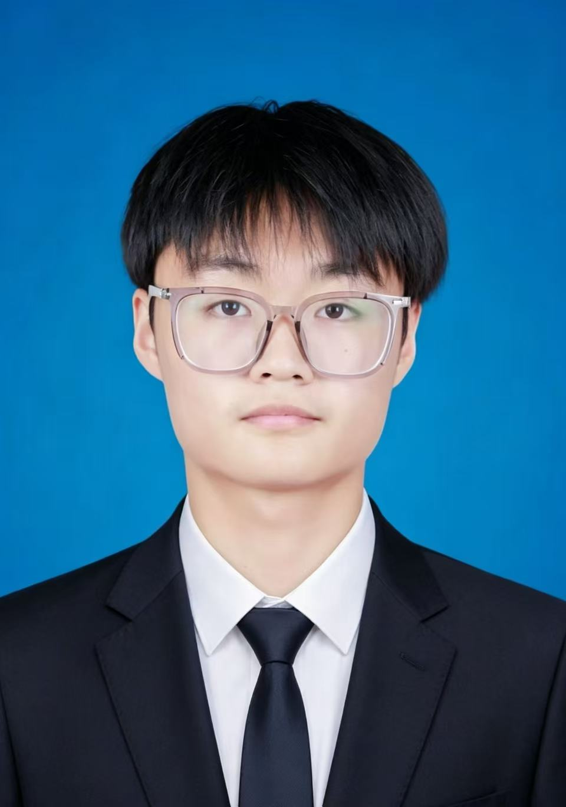
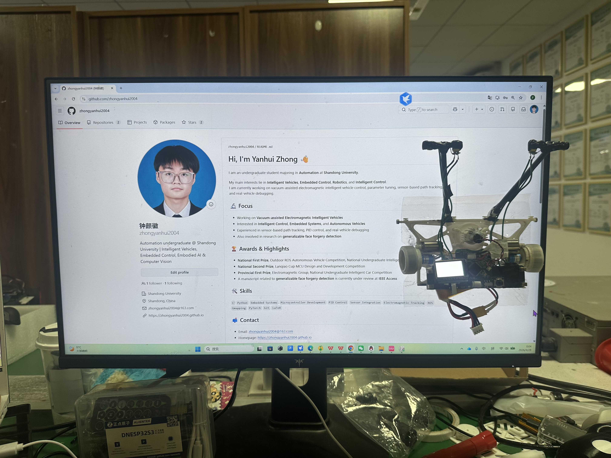

<table>
  <tr>
    <td width="72%" valign="top">

<h1>Yanhui Zhong</h1>

<strong>Undergraduate Student in Automation</strong> 
<strong>Shandong University</strong>

I am interested in <strong>Intelligent Vehicles</strong>, <strong>Embedded Control</strong>, 
<strong>Robotics</strong>, <strong>Embodied Intelligence</strong>, and <strong>Intelligent Control</strong>.

Currently, I mainly focus on <strong>vacuum-assisted electromagnetic intelligent vehicles</strong>, 
including sensor-based path tracking, embedded control, parameter tuning, and real-vehicle debugging.

<a href="mailto:zhongyanhui2004@163.com">Email</a> · 
<a href="https://github.com/zhongyanhui2004">GitHub</a>

</td>
<td width="28%" align="right" valign="top">
  
</td>
  </tr>
</table>

---

## 👋 About Me

I am an undergraduate student majoring in **Automation** at **Shandong University**.  
My academic and practical interests mainly lie in **intelligent vehicle systems**, **embedded control**, **sensor-based perception**, and **robotic systems**.

In recent work, I have been focusing on intelligent car competitions and real-vehicle debugging, especially in electromagnetic tracking, closed-loop control, parameter tuning, and system optimization.

I also have research experience in **computer vision**, especially in cross-dataset generalization for face forgery detection.

---

## 🎓 Education

**Shandong University**  
B.E. in **Automation**  
**Sep. 2023 – Present**

- GPA: **92.55 / 100**  
- GPA Ranking: **8 / 96**
- Comprehensive Ranking: **1 / 96**

**Selected Courses**

- Automatic Control Theory: **96**
- Modern Control Theory: **97**
- Signals and Systems: **99**
- Analog Electronics: **97**
- Digital Electronics: **96**
- Power Electronics: **96**
- Microcomputer Principles: **94**
- Microcontroller Principles: **95**
- Artificial Neural Networks and Deep Learning: **98**

---

## 🔍 Research Interests

`Intelligent Vehicles` `Embedded Control` `Robotics` `Embodied Intelligence`  
`Intelligent Control` `Computer Vision` `Autonomous Systems`

---

## 🚗 Projects & Competitions

### Vacuum-assisted Electromagnetic Intelligent Vehicle

I am currently working on a **vacuum-assisted electromagnetic intelligent vehicle** system.  
My work mainly involves:

- Electromagnetic sensor-based path tracking
- Embedded control system development
- Speed and steering control strategy design
- Parameter tuning and real-vehicle debugging
- Stability improvement for cornering and path following
- Signal filtering and noise reduction for robust tracking

**Related Award**

- **Provincial First Prize**, Electromagnetic Group, National Undergraduate Intelligent Car Competition

---

### Outdoor ROS Autonomous Vehicle

Participated in the development and debugging of an outdoor autonomous vehicle system for real-world scenarios.

My work included:

- LiDAR-based path tracking
- PID-based vehicle control
- State-machine design for multi-task handling
- Real-time pose-based vehicle behavior control
- Gmapping-based 2D mapping
- Map saving and ROS system integration
- Real-vehicle deployment and competition debugging

**Related Awards**

- **National First Prize**, Outdoor ROS Autonomous Vehicle Competition, National Undergraduate Intelligent Car Competition
- **First Prize**, North China Division, Outdoor ROS Autonomous Vehicle Competition

---

### MCU Design and Embedded Development

Participated in embedded system development and hardware-software co-design training.

My work and training covered:

- Embedded C programming
- Microcontroller-based development
- Basic analog and digital circuit debugging
- Integrated software and hardware debugging
- Engineering implementation under time constraints

**Related Award**

- **National Second Prize**, Lanqiao Cup MCU Design and Development Competition

---

## 🔬 Research Experience

### Cross-dataset Generalization for Face Forgery Detection

Participated in a research project on **generalizable face forgery detection**.

My work involved:

- Literature review on face forgery detection and cross-dataset generalization
- Study of multi-prototype modeling and generalization enhancement methods
- Experiment reproduction based on **CLIP ViT-L/14**
- Lightweight fine-tuning with **LN-tuning**
- Experiments related to **MPAM** and **PDUR**
- Environment configuration, code debugging, experiment running, metric collection, and result analysis
- Evaluation on datasets including **CDFv2**, **DFD**, **DFDC**, and **FFIW**

A manuscript related to **generalizable face forgery detection** has been submitted to **IEEE Access** and is currently under external review.  
I contributed as a **co-first author**.

---

## 🏆 Honors & Awards

### Competitions

- **National First Prize**, Outdoor ROS Autonomous Vehicle Competition, National Undergraduate Intelligent Car Competition
- **National Second Prize**, Lanqiao Cup MCU Design and Development Competition
- **Provincial First Prize**, Electromagnetic Group, National Undergraduate Intelligent Car Competition
- **First Prize**, North China Division, Outdoor ROS Autonomous Vehicle Competition
- **Provincial First Prize**, Shandong Science and Technology Festival
- **Provincial Award**, TI Cup National Undergraduate Electronics Design Contest
- **1st Place**, Electromagnetic Group, HIT Intelligent Car Invitational Competition

### Scholarships & Honors

- **First-Class Outstanding Student Scholarship**, Shandong University, 2024–2025
- **Second-Class Outstanding Student Scholarship**, Shandong University, 2023–2024
- **Outstanding Student Cadre**, Shandong University, 2024–2025
- **Merit Student**, 2023–2024
- **Special Talent Award**, Shandong University, 2025
- **Outstanding Social Practice Team**, Shandong University, Winter Vacation 2024

---

## 🛠️ Skills

**Programming & Research**

`C` `Python` `PyTorch` `Experiment Reproduction` `Result Analysis`

**Intelligent Vehicles & Control**

`Embedded Systems` `Microcontroller Development` `PID Control`  
`Sensor Integration` `Electromagnetic Tracking` `Parameter Tuning` `Real-vehicle Debugging`

**Robotics & Tools**

`ROS` `Gmapping` `Git` `LaTeX` `Overleaf`

---

## 📸 Project Snapshot

Vacuum-assisted electromagnetic intelligent vehicle debugging and personal homepage setup.

---

## 📫 Contact

- **Email:** [zhongyanhui2004@163.com](mailto:zhongyanhui2004@163.com)
- **GitHub:** [github.com/zhongyanhui2004](https://github.com/zhongyanhui2004)
- **Homepage:** [zhongyanhui2004.github.io](https://zhongyanhui2004.github.io)
